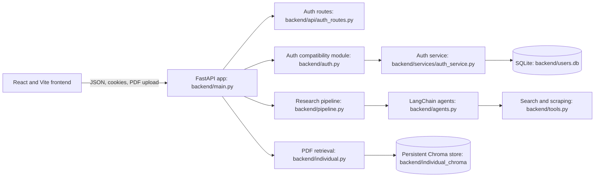

# Architecture and Module Reference

This guide describes the code currently in the repository. App setup, API handlers, feature workflows, and SQLite persistence now have separate owners; the document-analysis domain is still intentionally grouped in one module.

## Request and Data Flow



The browser stores the session identifier only in an HttpOnly cookie managed by the API. Research and PDF question requests require permission-bearing sessions. Model/search calls leave the local process and require external provider credentials.

## Backend Modules

### Application, routes, and deployment

- `backend/main.py`: creates the FastAPI app, configures CORS and lifespan database initialization, includes feature routers, and installs request-limiting middleware. It contains no feature endpoint handlers.
- `backend/demo.py`: a local-only app entrypoint that reuses the production router/auth wiring while overriding research/PDF service dependencies with deterministic placeholders, disabling Redis, and isolating SQLite/PDF files in the system temp directory. It seeds a known admin account for UI walkthroughs.
- `backend/api/auth_routes.py`: defines request models and endpoints for registration, login, session restore, logout, and password reset/OTP; successful registrations synchronize account creation timestamps, while successful logins write login activity; exports `router`.
- `backend/api/research_routes.py`: owns `POST /api/research` and `ResearchRequest`. It uses `research_session` for permission checks and `get_research_pipeline` as a lazy, overrideable dependency, allowing route tests to run without importing provider code.
- `backend/api/individual_routes.py`: owns PDF upload, document preview/download, and document-chat routes plus `IndividualQuestionRequest`. Lazy dependencies `get_document_indexer`, `get_document_answerer`, and `get_document_pdf_resolver` keep vector-store and model imports out of route-only tests.
- `backend/api/admin_routes.py`: owns dashboard and admin user/login-history HTTP endpoints. It delegates operations to `backend/services/admin_service.py` and uses the admin authorization dependency.
- `backend/api/health_routes.py`: owns `GET /api/health`.
- `backend/middleware/rate_limit.py`: configures the request limiter and exposes `install_rate_limit_middleware(app)`. `get_rate_limit_client`, `_memory_rate_limit`, `_redis_rate_limit`, and `rate_limit_request` support Redis with in-memory fallback.
- `backend/api/index.py`: Vercel adapter that imports the FastAPI app. `backend/vercel.json` configures frontend/backend services and `/api` rewrites for Vercel deployment.

### Configuration, security, and authentication

- `backend/config.py`: `Settings`, `_load_dotenv_if_present`, and `get_settings` centralize environment-backed settings. It optionally loads the repository-root `.env` and uses defaults for local development.
- `backend/security.py`: dependency-light helpers: `normalize_email`, `is_password_strong_enough`, and `is_session_active`; `LoginAttemptTracker` provides an in-memory, clock-injectable tracker suitable for isolated tests.
- `backend/services/auth_service.py`: authentication/session business logic. It owns password hashing, account and session workflows, role/permission checks, login throttling, event/recovery workflows, and calls the repository for persistence. `init_db()` delegates schema setup to the repository; it is not invoked automatically on module import.
- `backend/services/admin_service.py`: admin dashboard read orchestration, protected-account deletion policy, and login-history operations. It translates repository results into service-level outcomes without importing FastAPI.
- `backend/auth.py`: compatibility facade re-exporting auth-service symbols so older imports can continue to use a stable module path.
- `backend/repositories/sqlite_repository.py`: sole owner of SQLite connections and SQL. It provides semantic operations for users, sessions, OTPs, events, admin dashboards, and login activity, plus `init_auth_tables` and `initialize_admin_database` for schema setup and legacy repair.

### Research and document processing

- `backend/pipeline.py`: `run_research_pipeline(topic)` orchestrates web search, scraping, report writing, and a currently skipped critic stage. It includes fixed 20-second delays around model calls.
- `backend/agents.py`: constructs the Groq-backed LangChain model, search agents, writer prompt/chain, and critic prompt/chain. It depends on provider configuration at runtime and imports `StrOutputParser` for the chains.
- `backend/tools.py`: `tavily_search` wraps Tavily search results; `scrape_webpage` fetches a page and extracts readable text with Requests and Beautiful Soup.
- `backend/individual.py`: PDF-specific retrieval-augmented question answering. It extracts PDF pages, detects headings, chunks documents, generates content hashes, persists Mistral embeddings in Chroma, and answers document questions or full-document summary prompts using Groq. `build_individual_index` indexes a PDF; `answer_individual_question` answers a question for a document ID; `get_pdf_path` validates and locates saved PDFs; `invoke_with_retry` retries rate-limit failures.

### Frontend

- `frontend/src/main.jsx`: mounts the React app and global styles.
- `frontend/src/App.jsx`: owns authentication/session restore, main tab selection, research submission/report display, and navigation between login, registration, individual documents, and admin dashboard. It is a large stateful component and is not yet split into smaller workflow modules.
- `frontend/src/config.js`: exports `API_URL`, using `VITE_API_URL` or an empty prefix for same-origin API requests.
- `frontend/vite.config.js`: configures React and proxies local `/api` requests to `http://127.0.0.1:8001` during Vite development.
- `frontend/src/login.jsx`, `register.jsx`, and `Forgotpassword.jsx`: authentication and password-reset UI.
- `frontend/src/Individual.jsx`: PDF upload and document-chat UI.
- `frontend/src/Dashboard.jsx`: admin dashboard UI.
- `frontend/src/styles/` and `frontend/src/index.css`: global and feature styles; `frontend/src/Atmosphere.jsx` provides the visual background component.

## API Routes

| Method | Path | Handler responsibility |
| --- | --- | --- |
| GET | `/api` | API liveness message |
| POST | `/api/register` | Create a user account |
| POST | `/api/login` | Authenticate and set the session cookie |
| GET | `/api/session` | Restore the current session |
| POST | `/api/logout` | Invalidate the session and clear its cookie |
| POST | `/api/forgot-password` | Request a password-reset OTP by email |
| POST | `/api/verify-otp` | Verify a password-reset OTP |
| POST | `/api/reset-password` | Set a new password after OTP verification |
| POST | `/api/research` | Run the web research pipeline; requires `research` permission |
| POST | `/api/individual/upload` | Index an uploaded PDF; requires `document_upload` permission |
| POST | `/api/individual/chat` | Ask a question about an indexed PDF; requires `document_chat` permission |
| GET | `/api/individual/{document_id}/file` | Preview or download the original PDF; requires `document_chat` permission |
| GET | `/api/admin/dashboard` | Return users, login activity, and recent security events; admin only |
| DELETE | `/api/admin/users/{user_id}` | Delete a non-admin user and that user's login history; admin only |
| DELETE | `/api/admin/logins/{activity_id}` | Delete one login-history row; admin only |
| DELETE | `/api/admin/logins` | Delete all login-history rows; admin only |
| GET | `/api/health` | Return API health and SQLite filename |

Successful logins are recorded in the `login_activity` table by the auth route through `record_login_activity`; the admin dashboard reads those rows.

`backend/tests/test_api_routes.py` exercises feature routers using small FastAPI instances, injected service functions, and temporary SQLite data. Its app-bootstrap test enters the ASGI lifespan with database initialization stubbed. No route test contacts external providers.

## Persistence

- `backend/users.db`: SQLite database for users, password reset OTPs, sessions, security events, and login activity. The app initializes/repairs it in the FastAPI lifespan; isolated tests initialize temporary databases explicitly.
- `backend/individual_chroma/`: persistent Chroma data plus uploaded PDF files. This directory contains application data and should be treated as state, not source code.
- Demo mode uses a separate SQLite file and uploaded-PDF directory under the system temporary directory; configure `NEXUS_DEMO_DB_PATH` and `NEXUS_DEMO_DOCUMENTS_DIR` to change those locations.

## Tests

`backend/tests/` contains focused tests for pure security helpers, auth-service behavior with a temporary SQLite path, and repository initialization with a temporary database. Run from the repository root:

```bash
python -m pytest backend/tests -q
```
